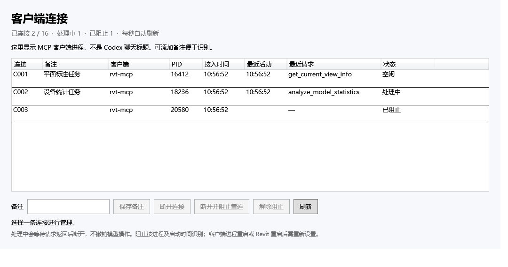

# H2-Revit

**Revit 2026 的 MCP 多客户端连接与连接管理增强版。** 基于 [bimwright/rvt-mcp](https://github.com/bimwright/rvt-mcp) 0.6.1，保留 Apache-2.0 许可和原作者归属。

[下载安装包](https://github.com/EliLeung/Revit-MCP/releases/download/v0.1.0-beta.1/H2-Revit-v0.1.0-beta.1-Revit2026-win-x64.zip) · [发布说明](https://github.com/EliLeung/Revit-MCP/releases/tag/v0.1.0-beta.1) · [许可证](LICENSE) · [第三方声明](THIRD-PARTY-NOTICES.md)

## 第一版功能

- 最多 16 个 MCP 客户端同时连接同一个 Revit 2026 实例。
- Revit「附加模块 → H2-Revit → 连接管理」窗口，每秒刷新。
- 显示连接编号、客户端进程、PID、接入时间、最近请求、活动时间和状态。
- 备注名称、选择性断开、临时阻止重连与解除阻止。
- 保留原项目的 Revit 工具；内含独立运行的 Windows x64 MCP 服务程序。



图中为独立 WPF 窗口的示例数据，不是真实用户会话记录。

## 下载与安装

当前版本：**v0.1.0-beta.1**。支持 Windows x64、已安装并正常运行的 **Revit 2026**。其他 Revit 年份的原始工程保留在源码中，但本发行版不提供其安装包或兼容承诺。

1. 下载上方 ZIP 并完整解压，不要在压缩包内直接运行。
2. 保存模型、关闭 Revit，双击 `Install.cmd`。无需管理员权限或 .NET SDK。
3. 打开 Revit 2026，查看「附加模块 → H2-Revit」。插件尚未代码签名；若 Revit 显示插件加载确认，请核对来源后按你的组织策略处理。
4. 配置 MCP 客户端，然后重新加载客户端配置。

安装目录：`%LOCALAPPDATA%\H2-Revit\versions\0.1.0-beta.1`。安装器只写当前用户目录，自动备份已有的同 ID 插件注册，不修改模型或自动改写 Codex 配置。

### Codex 配置

安装后打开 `%LOCALAPPDATA%\H2-Revit\codex-mcp.toml`，将其中已展开绝对路径的配置加入 `%USERPROFILE%\.codex\config.toml`。如已有 `rvt-mcp` 配置，请替换原条目，避免重复加载同一组工具。

配置格式如下，`YOUR_WINDOWS_USER` 必须替换为实际目录；安装器生成的文件已自动替换：

```toml
[mcp_servers.h2-revit]
command = 'C:\Users\YOUR_WINDOWS_USER\AppData\Local\H2-Revit\versions\0.1.0-beta.1\server\H2-Revit-MCP.exe'
args = ["--toolsets", "all"]
```

其他支持 stdio MCP 的客户端使用同一可执行程序和参数。MCP 工具名称保留原来的 `revit_` 前缀。

## 连接管理的行为

- 显示的是 **MCP 客户端连接**，不能直接读取 Codex 聊天标题，也不保证一条连接恰好对应一个聊天。
- 备注只保留到当前连接退出。
- 普通断开后，客户端可能自动重连。
- 阻止重连使用操作系统提供的 PID 和进程启动时间，同进程的连接都会受到影响；进程重启后是新身份。
- 重启 Revit 或停止再开启 MCP 会清除临时阻止。
- 正在处理的请求返回后再断开。不会撤销模型操作或强制取消正在执行的 Revit 命令；请求超时后操作仍可能在执行。
- 多个客户端共享模型、当前视图和选择状态；模型操作仍进入 Revit 主线程队列。

## 卸载 / 恢复

保存模型并关闭 Revit，双击原解压目录的 `Uninstall.cmd`，恢复安装前的插件注册。安装文件和备份保留以便核对。自行加入的 MCP 客户端配置也需要移除或恢复。

如果存在系统级同 ID 插件，安装器会停止并提示先处理重复注册。若插件注册被后续修改，恢复脚本会拒绝覆盖新配置。

## 测试状态

本版作为 **测试版** 发布，不宣称生产环境或所有 Revit 项目都已验证。

- Revit 2026 插件编译通过。
- 真实 Windows 命名管道：16 客户端、48 次响应匹配、真实 PID 识别。
- 选择性断开、阻止/解除重连、认证失败隔离、20 次停止/重启测试通过。
- 连接注册表和独立 WPF 窗口按钮测试通过。
- 通用安装器在隔离目录验证安装、重复安装、恢复和校验失败处理。
- 两个独立发布版 MCP 客户端同时读取本机 Revit 当前视图成功，未保留模型内容。
- **Revit 内新窗口的人工验证、模型写入及多个真实 Codex 聊天的完整端到端验证尚未完成。**

## 从源码构建

需要 Windows 和 .NET 8 SDK：

```powershell
dotnet build src/plugin-r26/RvtMcp.Plugin.R26.csproj -c Release -p:RvtMcpSkipDeploy=true
dotnet run --project tests/H2.TransportTests/TransportTests.csproj -c Release
dotnet publish src/server/RvtMcp.Server.csproj -c Release -r win-x64 --self-contained true -p:PublishSingleFile=true -p:IncludeNativeLibrariesForSelfExtract=true -p:DebugType=None -p:DebugSymbols=false
```

打包脚本：安装 Python 3 后运行 `python release/build_package.py`，输出在 `artifacts/`。

当前分支采用独立提交历史；源码基于上游项目导入，原项目归属和许可继续保留。第三方 NuGet 依赖由构建工具获取，安装包不包含 Autodesk Revit/RevitAPI DLL。`README.upstream.md` 是原项目说明，支持范围和安装方式以本文为准。

## License / Attribution

Apache License 2.0. Original project copyright 2026 Khoa Le. See [LICENSE](LICENSE) and [THIRD-PARTY-NOTICES.md](THIRD-PARTY-NOTICES.md).

H2-Revit is an independent community enhancement, not an official Autodesk or upstream release.
